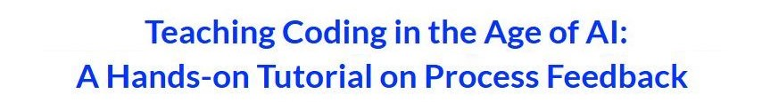

## About the workshop

* A three-hour, in-person pre-conference workshop at the [CCSC 2026 Conference](https://www.ccsc.org/centralplains/2026/)
* At Springfield, MO
* On Friday, April 10, 2026

## Learning objectives

- Learn to use Process Feedback's online compiler and explore its key features
- Practice integrating Process Feedback into your CS1 classroom
- Analyze sample student reports, explore **strategies for providing process feedback**, and discuss best practices

---

## Session I

* 💬 Introductions  
  &nbsp;&nbsp;&nbsp;&nbsp;&nbsp; "Your name, affiliation, and one challenge in teaching or grading"

* 🧠 Why process matters in the AI era  
  - Reflection vs experience (John Dewey)  
  - Challenges in coding education with AI  
  - Process vs product focus  

* ℹ What is Process Feedback? [SLIDES](https://docs.google.com/presentation/d/19RwGuIuZju2YE7jqKJ3S4uqV3Mzik3XHObLanrdGc98/edit?usp=sharing)   
  - A pedagogical alternative to AI detection  
  - Focus on reflection and making thinking visible  

* 🖥️ Overview of tools  
  - [Online compiler](https://www.processfeedback.org/coding) information page
  - Coding and writing process integrations  

* ✍️ Hands-on task: Coding + reflection  
  - Solve the rainfall problem in the [online compiler](https://code.processfeedback.org)  
  - Focus on your process (not correctness)  

* 📊 Understanding coding process reports  
  - What a report captures (runs, revisions, effort, timeline)  
  - Why the process tells a different story than final code  

* 💬 Components of a coding process report  

* 📖 Typical and atypical coding patterns  
  - [Report #1](https://app.processfeedback.org/coding/c_2024-06_sample_report_1?report=true)  
  - [Report #2](https://app.processfeedback.org/coding/c_2024-07-sample_report_2?report=true)  
  - [Report #3](https://app.processfeedback.org/coding/c_2024-08-sample_report_3?report=true)  
  - [Report #4](https://app.processfeedback.org/coding/c_2025-02-sample_report_4?report=true)  

* 🤸 Break

---

## Session II

* 📊 Implementation insights  
  - Badri: UMSL experience (CS1/CS2 at scale)  
  - Jie: SLU implementation  

* 🔍 What we observed from real classrooms  
  - Student reflection improved  
  - Effort became visible  
  - Early intervention became possible  
  - Conversations shifted from result → process  

* 🖥️ Hands-on: Course setup  
  - [Creating a Course](https://app.processfeedback.org/createeditor)  
  - [Creating an Assignment](https://app.processfeedback.org/createassignment)

* 📖 Instructor workflow  
  - [Teacher Guide](https://processfeedback.org/docs/teacher-guide-coding/)  
  - Practical integration strategies  

* 📖 Reflection design  
  - [Reflection Assignments](https://processfeedback.org/docs/coding-assignments/)  
  - How to prompt meaningful student reflection  

* 🤖 AI integration with Process Feedback  
  - Explain Code / Explain Error features  
  - AI for real-time teacher feedback  
  - AI as a reflection partner (not a shortcut)  

* 🎯 Recommended strategies for CS1  
  - Focus on process, not just correctness  
  - Require reflection or presentations  
  - Use reports for discussion, not policing  

* 🚀 What's on the horizon  
  - Scaling process data  
  - VS Code extension improvements  
  - AI-assisted reflection features  

---

## Related publications  

* "Teaching coding in the age of AI: A hands-on tutorial on Process Feedback"   
  📔 SIGCSETS, 2025 | 👤 Badri Adhikari and Jie Hou | [Read Online](https://dl.acm.org/doi/abs/10.1145/3641555.3704753)

* "Coding process visualizations for improved learning and academic integrity in CS1"  
  📔 World Congress in Computer Science, Computer Engineering, and Applied Computing, CSCE 2024 | 👤 Badri Adhikari and Nirala Lamichhane | [Read Online](./CSCE_2024_PF.pdf)

* "Maximizing student engagement in coding education with explanatory AI"  
  📔 IEEE FIE 2024 | 👤 Badri Adhikari, Sameep Dhakal, and Aadya Jha | [Read Online](./IEEE_FIE_2024_PF.pdf)

* "Engaging students to learn coding in the AI era with emphasis on the process"  
  📔 Edukasiana: Jurnal Inovasi Pendidikan, 2023 | 👤 Kate Arendes, Shea Kerkhoff, and Badri Adhikari | [Read Online](https://ejournal.papanda.org/index.php/edukasiana/article/view/728)

* "Pensieve: Feedback on coding process for novices."   
  📔 Proceedings of the 50th acm technical symposium on computer science education, 2019 | 👤 Lisa Yan, Annie Hu, and Chris Piech | [Read Online](https://dl.acm.org/doi/abs/10.1145/3287324.3287483)  
 
* "Computational thinking"    
  📔 Communications of the ACM, 2006 | 👤 Jeannette M. Wing | [Read Online](https://dl.acm.org/doi/abs/10.1145/1118178.1118215)

* "Thinking beyond chatbots’ threat to education: Visualizations to elucidate the writing or coding process"   
  📔 Education Sciences, 2023 | 👤 Badri Adhikari | [Read Online](https://www.mdpi.com/2227-7102/13/9/922)

## Facilitators

 
   <a href="https://badriadhikari.com/">Dr. Badri Adhikari</a>
   University of Missouri-St. Louis

 
   <a href="https://directory.natsci.msu.edu/Directory/Profiles/Person/105655?org=44&group=145">Dr. Jie Hou</a>
   Michigan State University

